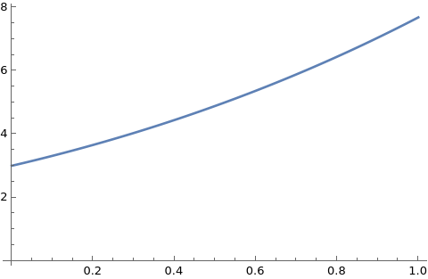

# Euler Method for Solving ODEs

## Problem Statement

Given the first-order ordinary differential equation (ODE):

$$\frac{dy}{dx} = f(x, y)$$

with an initial condition:

$$y(x_0) = y_0,$$

we aim to approximate the solution over the interval $[x_0, x_n]$ using the Euler method.

### Approach

The Euler method is a simple numerical technique that provides an iterative solution to the ODE. The main idea is to use the slope at the beginning of an interval to estimate the function's value at the next point.

1. **Discretize the interval:** Divide the interval $[x_0, x_n]$ into $n$ equal subintervals of width $h$, where:
   $$h = \frac{x_n - x_0}{n}.$$

2. **Iteration Formula:** The iterative formula for the Euler method is given by:
   $$y_{i+1} = y_i + h f(x_i, y_i),$$
   where $y_i$ is the approximation of $y(x_i)$, and $x_i = x_0 + ih$.

3. **Initialization:** Start with the initial condition:
   $$y_0 = y(x_0).$$

### Example

Consider the ODE:
$$\frac{dy}{dx} = y - x^2,$$
with the initial condition $y(0) = 3$. We can apply the Euler method to approximate $y$ over the interval $[0, 1]$.

### Conclusion

The Euler method provides a straightforward way to numerically solve ODEs, though its accuracy depends on the step size $h$ and the nature of the function $f(x, y)$.

## Graphs

### Euler Method Graph

The graph below shows the approximate solution obtained using the Euler method.

### Wolfram Graph

The graph below represents the exact solution provided by Wolfram Alpha.

## Conclusion

By comparing the two graphs, we can analyze the accuracy of the Euler method in approximating the solution to the ODE. The differences in the graphs highlight the method's effectiveness and its limitations in capturing the exact behavior of the solution.